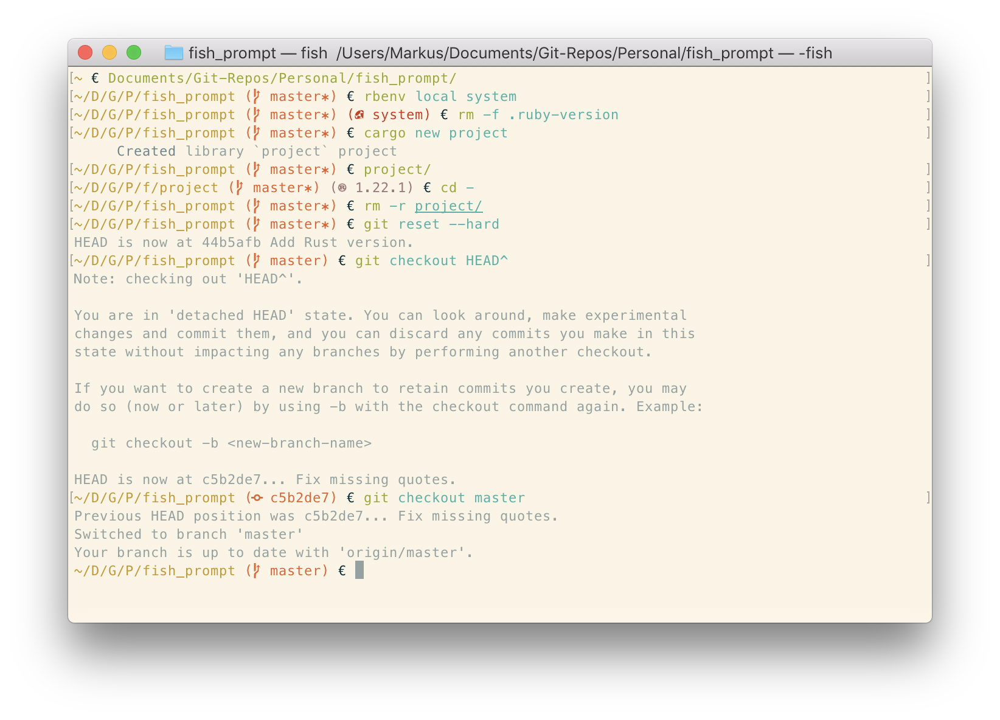

# fish_prompt

My prompt for Fish Shell.


## Installation

With [`fisherman`](https://github.com/fisherman/fisherman):

```
fisher add reitermarkus/fish_prompt
```


## Requirements

You need to use a font from [NerdFonts](http://nerdfonts.com) in order to use the special icons.


## Features

- shows Git status
- shows Ruby version
- shows Rust version


## Screenshot


